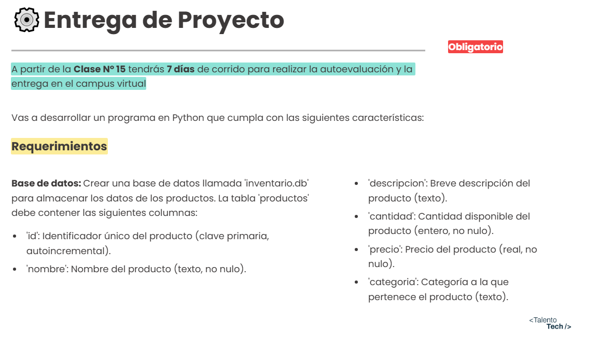
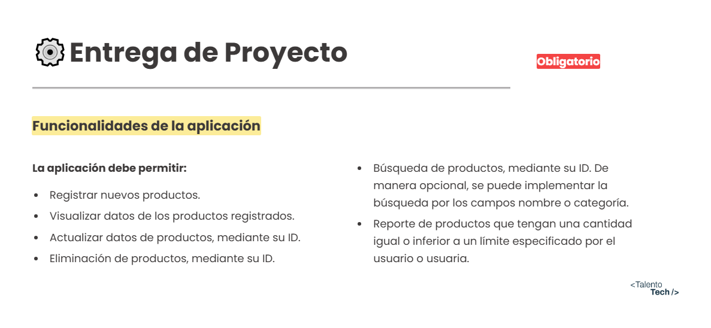
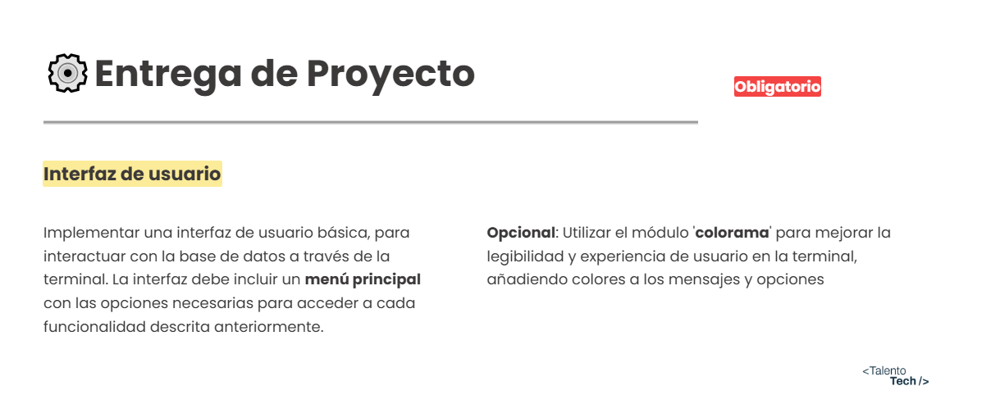
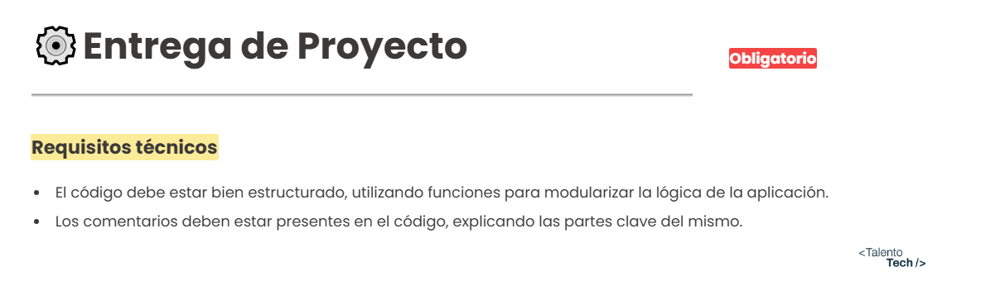
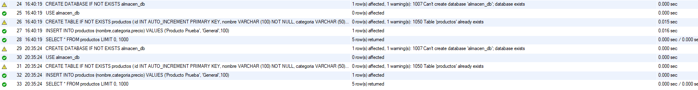
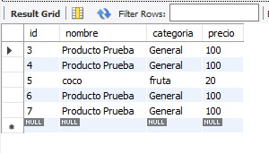
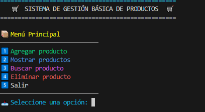
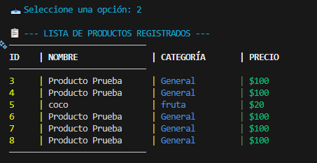
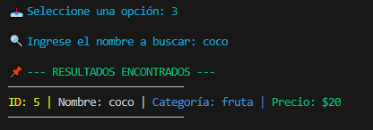

🛒 Sistema de Gestión de Productos con MySQL

Este proyecto es la evolución final de la pre-entrega anterior. Es una aplicación escrita en Python que ahora integra una base de datos MySQL para garantizar la presistencia de los datos.

📋 Consigna y Requisitos

Capturas de la consigna original y los requisitos del proyecto:

📌 Requerimientos generales

 

⚙️ Funcionalidades

 

🎨 Interfaz

 

🧾 Requisitos
 
 

🚀 Novedades de la Entrega Final

A diferencia de la versión anterior que usaba listas volátiles, esta versión incluye:

- 💾 Persistencia de Datos: Los productos se guardan en una base de datos MySQL (almacen_db). Si uno cierra el programa y    vuelve mañana, los datos siguen ahí.

- 🔌 Conexión Real: Uso del conector mysql-connector-python.

- 🆔 Identificadores Únicos: Gestión de productos mediante ID autoincremental de base de datos, no por posición en una lista.

- 🎨 Interfaz Mejorada: Uso obligatorio de la librería colorama para una experiencia visual profesional en la terminal.

- 🛡️ Seguridad y Validaciones: Manejo de errores de conexión y validación de tipos de datos antes de enviar consultas SQL.

📸 A continuación se muestran las capturas que guiaron esta entrega:

📦 Funcionalidades

- 1️⃣ Agregar producto:Inserta registros directamente en la tabla productos ( Nombre,Categoría,Precio).

- 2️⃣ Mostrar productos:Realiza una consulta SELECT para traer y listar todos los registros de la base de datos.

- 3️⃣ Buscar producto:Utiliza consultas LIKE de SQL para encontrar coincidencias parciales por nombre.

- 4️⃣ Eliminar producto:Elimina registros de forma segura utilizando su ID único de base de datos.

- 5️⃣ Salir:Cierra la conexión y termina el programa.

🛠️ Requisitos Técnicos

Para ejecutar este proyecto necesitas:

1. Python 3.x instalado.

2. Servidor MySQL (Puede ser a través de XAMPP o MySQL Community Server).

3. Librerías externas:
    - mysql-conector-python
    - colorama

⚙️ Instalación y Configuración

Sigue estos pasos para poner en marcha el sistema:

1.Clonar o descargar
Descarga los archivos del proyecto en tu computadora.

2.Instalar dependencias
Abre tu terminal en la carpeta del proyecto y ejecuta:

pip install mysql-connector-python colorama

3.Configurar la Base de Datos
Hay incluido un archivo llamado almacen_db.sql .
 
  1. Abre MySQL Workbench.
  2. Copia el contenido del archivo almacen_db.sql .
  3. Pégalo en una nueva consulta (Query) y ejecútalo (Icono del Rayo ⚡).
  4. Esto creará la base de datos almacen_db y la tabla productos.

4.Configurar la Conexión
Abre el archivo database.py y asegurarse de que la contraseña coincida con la de tu MySQL:

  DB_CONFIG = {
    'host': 'localhost',
    'user': 'root',
    'password': 'TU_CONTRASEÑA',  <-- ¡Cambia esto si es necesario!
    'database': 'almacen_db'
}

5.Ejecutar

python main.py

🗂️ Estructura del proyecto

Talento_Tech/Python/entrega-final
│
├── main.py             # Punto de entrada. Controla el flujo del menú.
├── database.py         # (Nuevo) Módulo exclusivo para gestionar la conexión a MySQL.
├── producto.py         # Lógica del CRUD. Ejecuta las consultas SQL (INSERT, SELECT, etc.).
├── utils.py            # Funciones visuales (limpiar pantalla, colores, encabezados).
├── almacen_db.sql  # (Nuevo) Script SQL para crear la estructura de la BD en Workbench.
│
├── README.md           # Documentación del proyecto.
└── assets/             # Capturas de pantalla y evidencias.
    ├── 01-Requerimientos.png
    ├── 02-Funcionalidades.png
    ├── 03-Interfaz.png
    ├── 04-Requisitos.png
    ├── 05-Captura-workbench-ok-png # Ticks verdes del script SQL
    ├── 06-Captura_lista_workbench.png  
    ├── 07-captura_menu_color.png    # Menú principal con colorama
    ├── 08-captura-listar.png    #Ejemplo de lista  
    └── 09-Captura-buscar.png    #Ejemplo de busqueda

🎨 Galería

1. Ejecución del Script SQL en Workbench:

 
  
    Es fundamental correr este script primero para crear la base de datos (Verificar los ticks verdes)
    
2. Captura de la Lista en Workbench:
 
 
  
   Asi es como quedan las listas en la base de datos 

3. Menú Principal con Base de Datos:

 

  Interfaz de usuario mejorada con colorama y opciones conectadas a MySQL

4. Ejemplo listar:
 
 

  Listado de productos en la base de datos mediante SQL

5. Ejemplo de Búsqueda:

 

  Búsqueda de productos en la base de datos mediante SQL 

👩‍💻 Autora

Carla
Estudiante de la Tecnicatura Superior en Programación en la UTN.
Apasionada por la administración de sistemas, scripting y visualización técnica. Este proyecto representa la integración de lógica de programación (Python) con gestión de datos (SQL), un paso fundamental en el desarrollo backend.