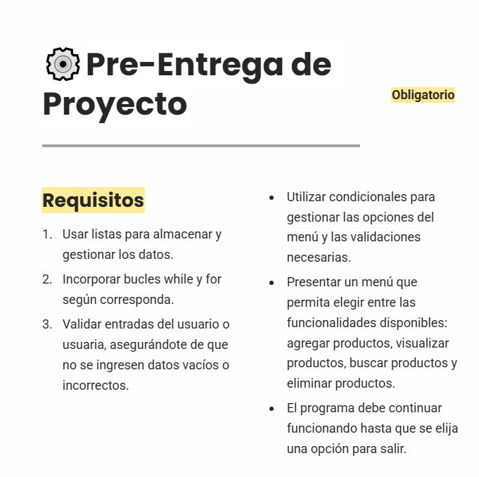
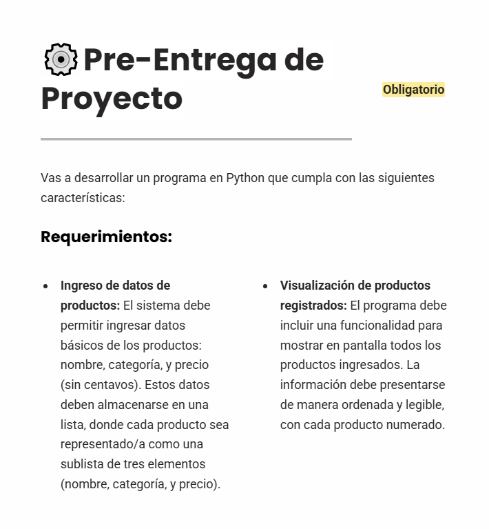
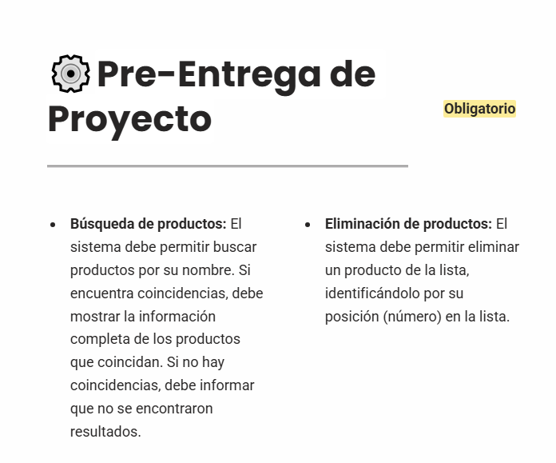
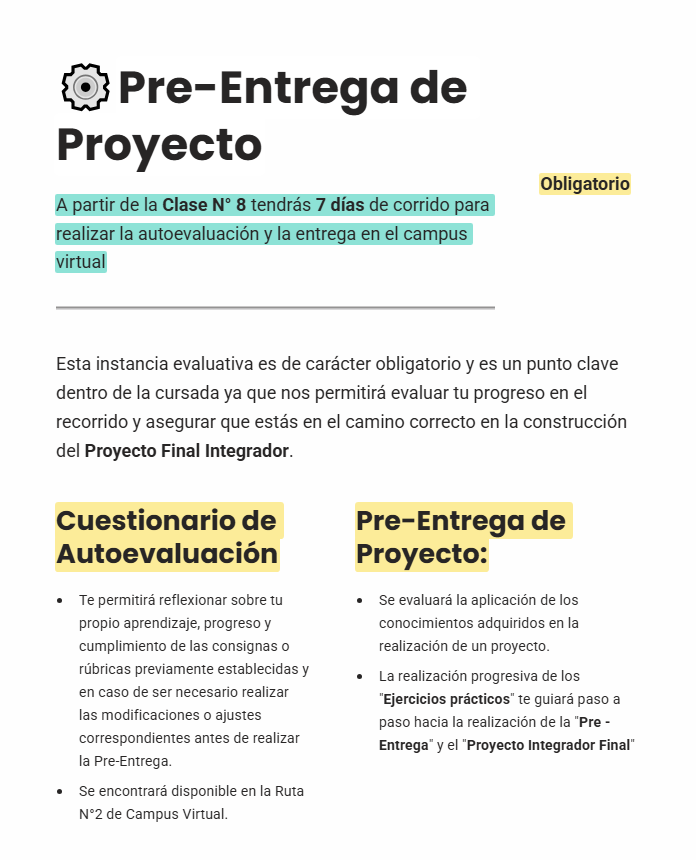
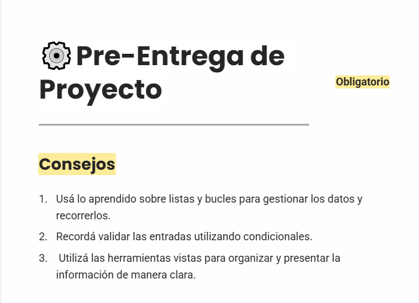
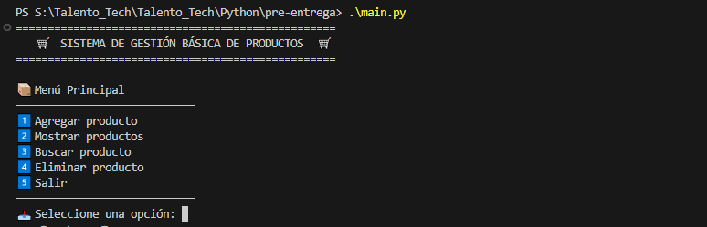
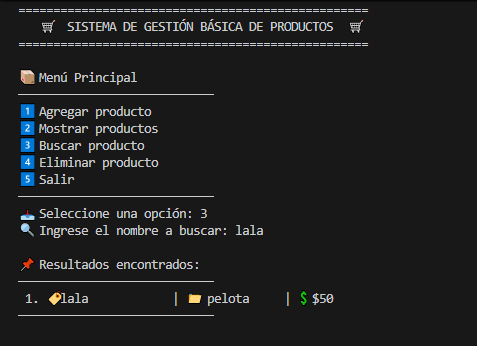

# 🛒 Sistema de Gestión Básica de Productos

 Este proyecto es una aplicación de consola escrita en Python que permite gestionar productos de forma sencilla. Ideal para paracticar estructuras de datos, bucles, condicionales y validaciones.

## 📋 Requisitos de la actividad

La consigna solicitaba implementar las siguientes funcionalidades:

- Ingreso de productos con nombre, categoría y precio (sin centavos)
- Visualización numerada de los productos registrados
- Búsqueda por nombre con coincidencias parciales
- Eliminación de productos por número de posición
- Validación de entradas
- Uso de listas, bucles `while` y `for`, y condicionales
- Menú interactivo que se repite hasta elegir "Salir"

📸 A continuación se muestran las capturas que guiaron esta entrega:

### 🧾 Requisitos generales



### 📌 Requerimientos específicos — Parte 1



### 📌 Requerimientos específicos — Parte 2



### 🧪 Ejercicio planteado



### 💡 Consejos del docente



---


## 📦 Funcionalidades implementadas:

- **Agregar producto** : Ingresar nombre,categoria y precio (sin centavos.).
- **Mostrar productos**: Visualizar todos los productos registrados, numerados (ID) y ordenados.
- **Buscar producto**: Buscar por nomer y mostrar coincidencias.
- **Eliminar producto**: Eliminar un producto por su numero ID de la lista.
- **Salir**: Finaliza el programa.

- Menú visual con emojis y bordes
- Validación de entradas vacías y numéricas
- Separación de funciones en archivos:
  - `main.py`: flujo principal y menú
  - `producto.py`: lógica de gestión de productos
  - `utils.py`: encabezado y menú visual

📸 Ejemplo del menú visual:



📸 Ejemplo de búsqueda de productos:



---


## 🎨 Estética en consola

Este sistema utiliza **emojis Unicode** para mejorar la experiencia visual en consola. Los íconos se agregan directamente en el código como parte de los mensajes, sin necesidad de instalar librerías externas.

Ejemplos:

- `✅` para confirmar acciones exitosas.
- `❌` para indicar errores o entradas inválidas.
-  `🛒`, `📦`, `🔍`, `🗑️` para representar funciones del sistema.

> ⚠️ Los emojis se muestran correctamente en la mayoría de terminales modernas. Si tu consola no los soporta, podés reemplazarlos por texto plano o símbolos ASCII.

También podés integrar colores en consola usando la librería [`colorama`](https://pypi.org/project/colorama/):

```bash
pip install colorama

```

## 🧠 Tecnologías utilizadas

- Python 3.x
- Visual Studio Coder 
- (Opcional) colorama para colores en consola 

## 🗂️ Estructura del proyecto

```python
Talento_Tech/Python/pre-entrega
│
preentrega_1/
│
├── main.py                 # Menú principal y flujo del programa
├── producto.py             # Funciones para agregar, mostrar, buscar y eliminar productos
├── utils.py                # Encabezado visual y menú con estilo
├── README.md               # Documentación específica de la entrega
│
└── assets/                 # Capturas de pantalla y evidencias visuales
    ├── 01_requisitos_generales.png
    ├── 02_requerimientos_1.png
    ├── 03_requerimientos_2.png
    ├── 04_ejercicio_enunciado.png
    ├── 05_consejos_docente.png
    ├── menu_visual.png
    └── ejemplo_busqueda.png

 
```


## Cómo ejecutar

1. Cloná o descargá el repositorio.
2. Abrí el proyecto en Visual Studio Code.
3. Ejecutá 'main.py' desde la terminal o el entorno de desarrollo.

```bash

python main.py

```
👩‍💻 Autora

 Carla - Estudiante en la carrera tecnico superior en programacion en la UTN. Apasionada por la administracion de sistemas, scripting y visualizacion tecnica. Este proyecto forma parte de mi preparacion sumando mas conocimientos a mi carrera para un mejor dominio del mismo. 


